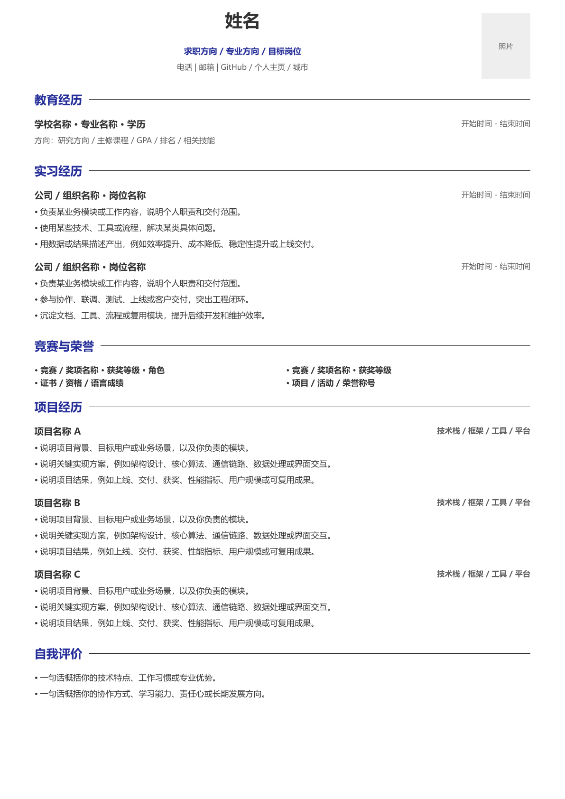

# Boweny CV

一个单文件 Typst 中文简历模板。模板把“内容区”和“排版区”分开，使用者主要修改 `cv.typ` 顶部的内容变量即可，不需要理解 Typst 的排版代码。

## 预览



## 特性

- 单文件模板，复制 `cv.typ` 即可使用
- 中文排版友好，默认使用 Microsoft YaHei / Segoe UI
- 支持可选证件照，不放照片时自动显示占位框
- 教育、经历、项目、荣誉、自我评价均使用结构化数据填写
- 项目技术栈和荣誉自动加粗
- 适合一页 A4 简历，可通过字号、边距、间距快速微调

## 快速开始

安装 Typst 后运行：

```powershell
typst compile cv.typ cv.pdf
```

也可以在 VS Code 中安装 Tinymist 扩展，打开 `cv.typ` 后直接预览或导出 PDF。

## 如何修改

打开 `cv.typ`，优先修改最上方的“简历内容区”：

```typst
#let cv-name = "姓名"
#let cv-role = "求职方向 / 专业方向 / 目标岗位"
#let cv-contact = "电话 | 邮箱 | GitHub / 个人主页 / 城市"
#let cv-photo-path = none
```

教育、经历、项目等内容都在同一个区域内：

```typst
#let projects = (
  (
    title: "项目名称 A",
    tech: "技术栈 / 框架 / 工具 / 平台",
    bullets: (
      [说明项目背景、目标用户或业务场景，以及你负责的模块。],
      [说明关键实现方案。],
      [说明项目结果。],
    ),
  ),
)
```

需要照片时，新建 `assets` 目录并放入照片，例如：

```text
assets/profile.jpg
```

然后修改：

```typst
#let cv-photo-path = "assets/profile.jpg"
```

不需要照片时保持：

```typst
#let cv-photo-path = none
```

## 调整样式

如果一页放不下，优先调整 `cv.typ` 中“可调样式区”的这些变量：

```typst
#let page-margin-y = 0.5cm
#let body-size = 8.65pt
#let gap = 0.80em
```

常用建议：

- 内容太挤：稍微增大 `gap` 或 `body-size`
- 内容放不下一页：稍微减小 `body-size`、`gap` 或 `page-margin-y`
- 照片太大/太小：调整 `photo-width` 和 `photo-height`

## 目录结构

```text
.
├── cv.typ              # 主模板
├── assets/             # 可选照片资源目录
├── docs/preview.png    # README 预览图
├── README.md
├── LICENSE
└── .gitignore
```

## 许可证

本项目使用 MIT License。你可以自由使用、修改和分发。
